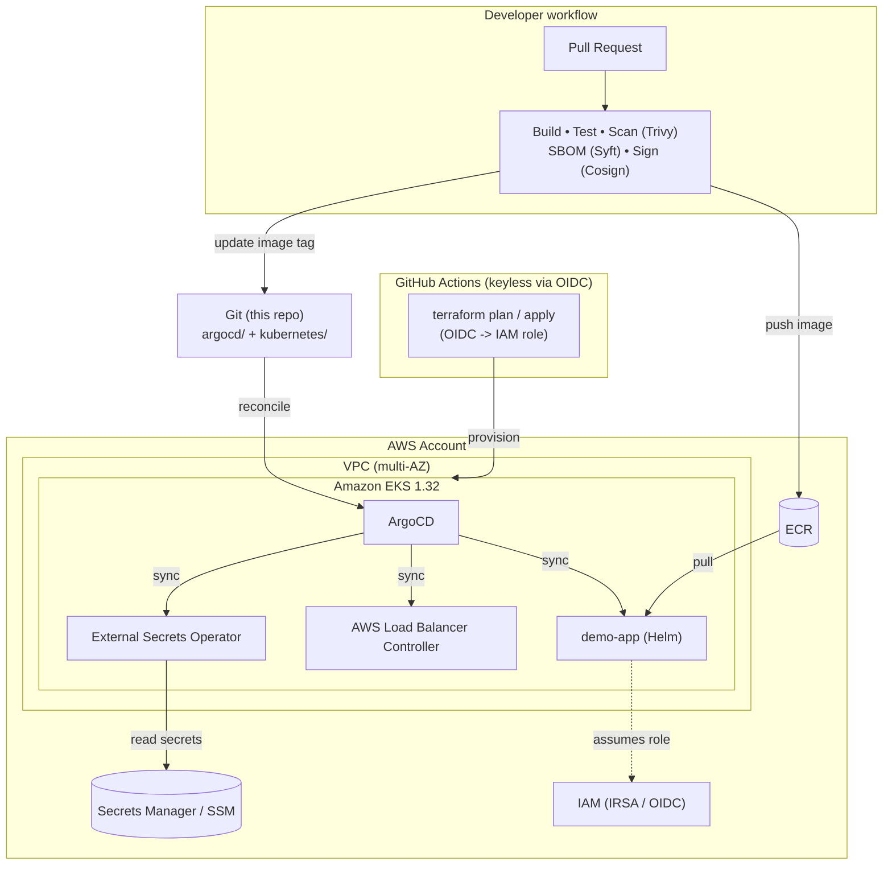

# eks-gitops-platform

> Production-grade Amazon EKS platform provisioned with Terraform and operated with ArgoCD GitOps. Keyless CI/CD via GitHub OIDC, pod-level IAM with IRSA, secrets synced from AWS Secrets Manager, and a supply-chain-secured image pipeline.

[](terraform/)
[](#)
[](argocd/)
[](.github/workflows/)
[](LICENSE)

This repository is a reference implementation of how a platform team runs Kubernetes on AWS in production. Infrastructure is declarative (Terraform), applications and platform add-ons are reconciled continuously from Git (ArgoCD app-of-apps), there are **no long-lived cloud credentials** anywhere in CI, and every container image is scanned, SBOM'd, and cryptographically signed before it can be deployed.

---

## Architecture



### How the pieces fit

| Layer | Tool | What it does | Why this choice |
|---|---|---|---|
| Infrastructure | Terraform + AWS provider | VPC, EKS cluster, managed node groups, core add-ons, IRSA roles | Declarative, reviewable, reproducible across `dev`/`staging`/`prod` |
| Delivery | ArgoCD (app-of-apps) | Continuously reconciles platform add-ons and apps from Git | Git is the single source of truth; drift is auto-corrected |
| CI identity | GitHub OIDC -> IAM role | Short-lived credentials, scoped to this repo + branch | No static AWS keys in GitHub secrets — eliminates the #1 leak vector |
| Pod identity | IRSA | Each workload assumes a least-privilege IAM role | No node-wide credentials; per-workload blast radius |
| Secrets | External Secrets Operator | Syncs Secrets Manager/SSM into Kubernetes Secrets | Secrets never live in Git |
| Supply chain | Trivy + Syft + Cosign | Scan, SBOM, sign images; verify signature at admission | Provenance + vulnerability gate before deploy |

A deeper write-up lives in [`docs/architecture.md`](docs/architecture.md), and the reasoning behind the major decisions is recorded as ADRs in [`docs/adr/`](docs/adr/).

---

## Repository layout

```
.
├── terraform/              # EKS, VPC, IAM/IRSA, core add-ons (multi-env via *.tfvars)
│   ├── *.tf                # root module
│   ├── environments/       # dev / staging / prod variable files
│   └── modules/            # thin internal wrappers (see terraform/README.md)
├── argocd/                 # GitOps: app-of-apps root, AppProject, Applications
│   ├── bootstrap/          # root "app of apps" you apply once
│   ├── projects/           # ArgoCD AppProject (RBAC + allowed sources/destinations)
│   └── applications/       # one Application per platform add-on / app
├── kubernetes/
│   ├── apps/demo-app/      # example workload as a Helm chart (HPA, PDB, NetworkPolicy)
│   └── platform/           # platform-level manifests
├── .github/workflows/      # CI (build/scan/sign) + terraform plan/apply (OIDC)
├── scripts/                # bootstrap.sh / teardown.sh
└── docs/                   # architecture, runbook, ADRs, cost notes
```

---

## Quickstart

> **Prerequisites:** an AWS account, `terraform >= 1.6`, `awscli v2`, `kubectl`, `helm`, and (for the supply-chain steps) `cosign` + `syft`. Everything is pinned in [`.pre-commit-config.yaml`](.pre-commit-config.yaml) / the Makefile.

```bash
# 0. (one time) create the remote-state backend — see scripts/bootstrap.sh
make backend ENV=dev

# 1. provision the cluster
make init   ENV=dev
make plan   ENV=dev
make apply  ENV=dev

# 2. point kubectl at the new cluster
make kubeconfig ENV=dev

# 3. bootstrap GitOps — applies the app-of-apps root; ArgoCD takes over from here
make bootstrap-argocd

# 4. watch ArgoCD reconcile every platform add-on + the demo app
kubectl -n argocd get applications -w
```

Tearing everything down is a single command (it removes ArgoCD-managed resources first to avoid orphaned cloud load balancers):

```bash
make teardown ENV=dev
```

---

## Security model (the short version)

- **No static cloud credentials.** CI authenticates to AWS through a GitHub OIDC provider and assumes an IAM role whose trust policy is scoped to `repo:<owner>/<repo>:ref:refs/heads/main`. See [`terraform/github-oidc.tf`](terraform/github-oidc.tf).
- **Least-privilege pods.** Workloads that need AWS (External Secrets, the ALB controller) use IRSA roles, not node instance profiles.
- **Secrets stay out of Git.** Only `ExternalSecret` *references* are committed; the actual values are pulled from AWS Secrets Manager at runtime.
- **Signed images only.** The CI pipeline signs images with Cosign (keyless, Fulcio/Rekor). The cluster can enforce signature verification at admission (documented in the runbook).

---

## What this repo is meant to demonstrate

This is intentionally opinionated and production-shaped rather than a tutorial. It shows:
multi-environment Terraform with remote state and locking; the app-of-apps GitOps pattern; keyless CI; pod-level IAM; runtime secret syncing; and a software-supply-chain pipeline. The trade-offs (e.g. running ArgoCD via Terraform vs. fully self-managed, single vs. multi-NAT) are written down as ADRs so the *reasoning* is reviewable, not just the result.

## License

MIT — see [LICENSE](LICENSE).
