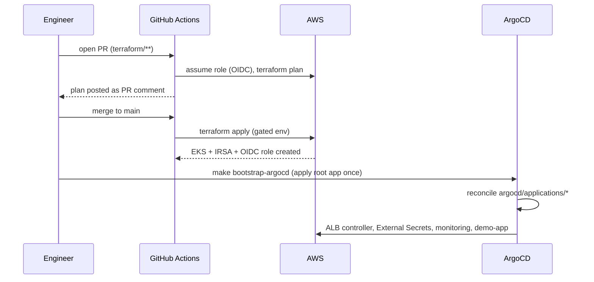
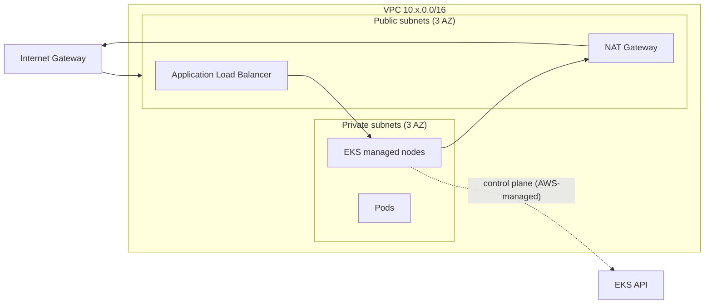

# Architecture

## Goals
- **Declarative everything.** Infra in Terraform; apps + add-ons in Git via ArgoCD.
- **No standing credentials.** CI uses GitHub OIDC; pods use IRSA.
- **Reproducible environments.** One root module, per-env state + tfvars.
- **Secure by default.** Signed images, runtime-synced secrets, hardened pods, NetworkPolicies.

## Provisioning flow

## Network topology

- Nodes live only in **private** subnets; the **ALB** in public subnets is the
  single ingress. Egress is via NAT (one per AZ in prod, single in dev/staging).
- The EKS control plane is AWS-managed; the API endpoint is public but
  authenticated (tighten to private/allow-listed for hardened environments).

## Identity boundaries
| Principal | Mechanism | Scope |
|---|---|---|
| GitHub Actions | OIDC federation -> IAM role | `repo:AbdullahAIOps/eks-gitops-platform:ref:refs/heads/main` only |
| External Secrets pod | IRSA | read `eks-gitops/*` secrets/params only |
| ALB controller pod | IRSA | ELB/EC2 describe + manage |
| EBS CSI controller | IRSA | EBS volume lifecycle |

## Trade-offs (recorded as ADRs)
- ArgoCD installed by Terraform, then self-manages — see ADR-0002 / ADR-0004.
- Keyless identity everywhere — ADR-0003.
- Single vs multi-NAT per environment — cost vs availability, see `cost.md`.
